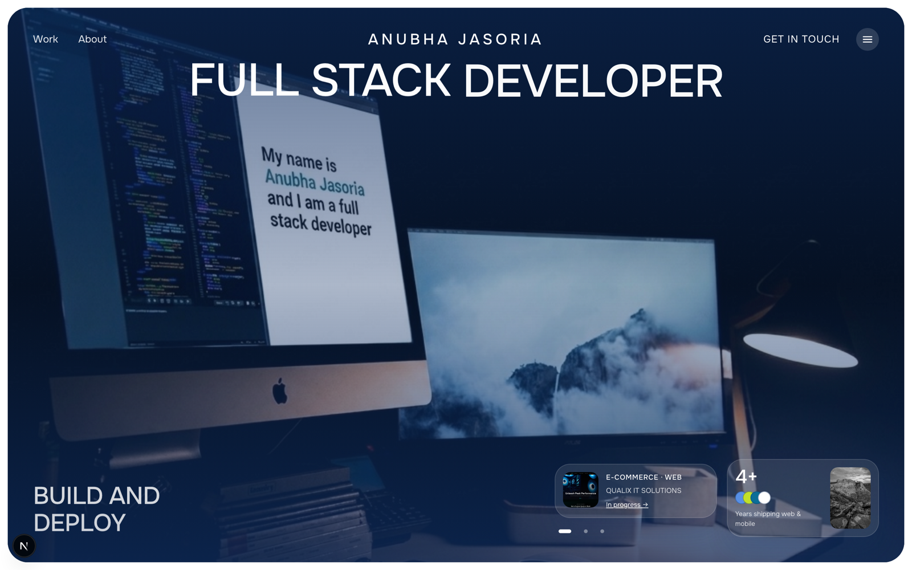

# Anubha Jasoria — Portfolio

My personal portfolio site. Built with **Next.js** and **TypeScript**, with a
custom animation layer (word-by-word hero reveal, spring cards, smooth scrolling
via Lenis) and all content driven from a single typed content file.

**Live:** [anubhajasoria.com](https://anubhajasoria.com)



## Tech

Next.js (App Router) · React · TypeScript · Lenis · custom CSS animations

## Structure

- `lib/data.ts` — all site copy, links, projects, experience, and skills live
  here in one typed file; components read from it.
- `app/` — App Router pages, layout, and SEO (JSON-LD `Person` schema, Open
  Graph, sitemap).
- `components/` — the section components (hero, about, work, experience, skills,
  footer).

## Run it

Requires Node 18+.

```bash
npm install
npm run dev      # http://localhost:3000
npm run build    # production build
npm run start    # serve the production build
```
